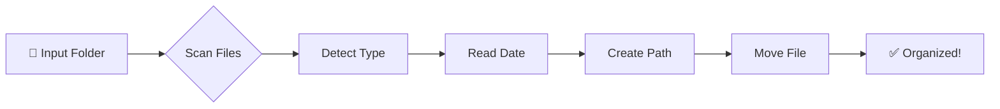

# 📸 Photo & File Organizer

<div align="center">

**🐳 Docker-powered file organizer that automatically sorts your media library**

[](https://www.docker.com/)
[](https://www.python.org/)
[](LICENSE)

</div>

---

## ✨ What It Does

Automatically organizes your messy files into a clean, structured hierarchy based on:

- 📂 **Category** → Photo, Video, Document, Audio, Other
- 📅 **Year** → Extracted from file modification date
- 🗓️ **Month** → Organized by month number

### 🎯 Example Output

```
📁 Your Folder
├── 📸 Photo/
│   └── 2024/
│       └── 01/
│           └── vacation.jpg
├── 🎬 Video/
│   └── 2023/
│       └── 12/
│           └── birthday.mp4
└── 📄 Document/
    └── 2025/
        └── 02/
            └── invoice.pdf
```

**✨ Bonus:** Works recursively — finds files buried deep in subfolders!

---

## 🚀 Quick Start

### 1️⃣ Build the Docker Image

```bash
make build
```

### 2️⃣ Organize Your Files

```bash
make run PATH_TO_SORT=/path/to/your/folder
```

**Example:**
```bash
make run PATH_TO_SORT=/media/kanekiezz/photo
```

### 3️⃣ Optional: Interactive Shell

Want to explore inside the container?

```bash
make bash
```

### 4️⃣ Cleanup

Remove the Docker image when done:

```bash
make clean
```

---

## 🎯 Features

| Feature | Description |
|---------|-------------|
| 🔍 **Smart Detection** | Auto-categorizes files by extension |
| 📅 **Date-Based Sorting** | Organizes by file modification time |
| 🔄 **Recursive Scanning** | Finds files in all subfolders |
| 🛡️ **Safe Operation** | Never overwrites existing files |
| 🏗️ **Auto-Create Folders** | Builds folder structure automatically |
| 🐳 **Dockerized** | Run anywhere without dependencies |
| 🎨 **Multi-Format** | Supports 25+ file types |

---

## 📋 Supported File Types

<table>
<tr>
<td>

**📸 Photos**
```
jpg, jpeg, png, gif
bmp, tiff, webp, heic
```

</td>
<td>

**🎬 Videos**
```
mp4, mov, avi, mkv
flv, wmv
```

</td>
</tr>
<tr>
<td>

**📄 Documents**
```
pdf, doc, docx, txt
xlsx, xls, ppt, pptx
```

</td>
<td>

**🎵 Audio**
```
mp3, wav, aac
flac, ogg
```

</td>
</tr>
</table>

> 📦 Everything else goes into the **Other/** category

---

## 🧠 How It Works



1. **Scans** your folder recursively
2. **Detects** file type by extension
3. **Reads** modification timestamp
4. **Creates** folder structure: `Category/Year/Month/`
5. **Moves** file to organized location
6. **Skips** already-organized folders

---

## 📖 Usage Examples

### Using Make (Recommended)

```bash
# Show help
make usage

# Build and run in one command
make build && make run PATH_TO_SORT=/media/kanekiezz/photo
```

### Using Docker Directly

```bash
docker build -t photo-sorter .
docker run --rm -v /path/to/folder:/data photo-sorter /data
```

### Using Python Directly (No Docker)

```bash
python organize.py /path/to/folder
```

---

## 🎨 Before & After

### Before 😰
```
messy_folder/
├── IMG_1234.jpg
├── random_folder/
│   ├── old_video.mp4
│   └── nested_folder/
│       └── document.pdf
└── vacation.mov
```

### After 😌
```
messy_folder/
├── Photo/
│   └── 2024/
│       └── 06/
│           └── IMG_1234.jpg
├── Video/
│   ├── 2024/01/
│   │   └── vacation.mov
│   └── 2023/12/
│       └── old_video.mp4
└── Document/
    └── 2024/05/
        └── document.pdf
```

---

## ⚙️ Configuration

Edit the `organize.py` script to customize:

- 📝 Add more file extensions
- 🎨 Change category names
- 📁 Modify folder structure
- 🔧 Adjust behavior

---

## 🛠️ Makefile Reference

```makefile
make build    # Build Docker image
make run      # Run organizer (requires PATH_TO_SORT)
make bash     # Open interactive shell
make clean    # Remove Docker image
make usage    # Show usage instructions
```

---

## 🤝 Contributing

Contributions welcome! Feel free to:

- 🐛 Report bugs
- 💡 Suggest features
- 🔧 Submit pull requests

---

## 📜 License

**MIT License** — Free to use, modify, and distribute.

---

## 💡 Pro Tips

- ✅ **Run on a copy first** to test behavior
- 🔄 **Already organized?** The script skips Photo/Video/Document/Audio/Other folders
- 🚀 **Large libraries?** Docker ensures consistent performance
- 📊 **Want logs?** Add verbosity to the Python script

---

<div align="center">

**Made with ❤️ for organized people**

⭐ Star this repo if it helped you!

</div>